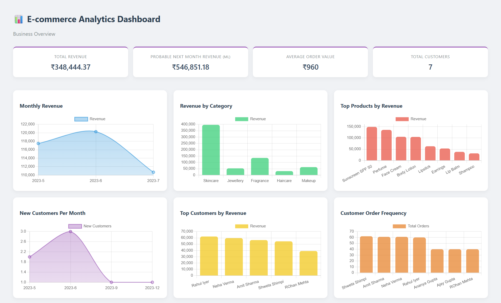
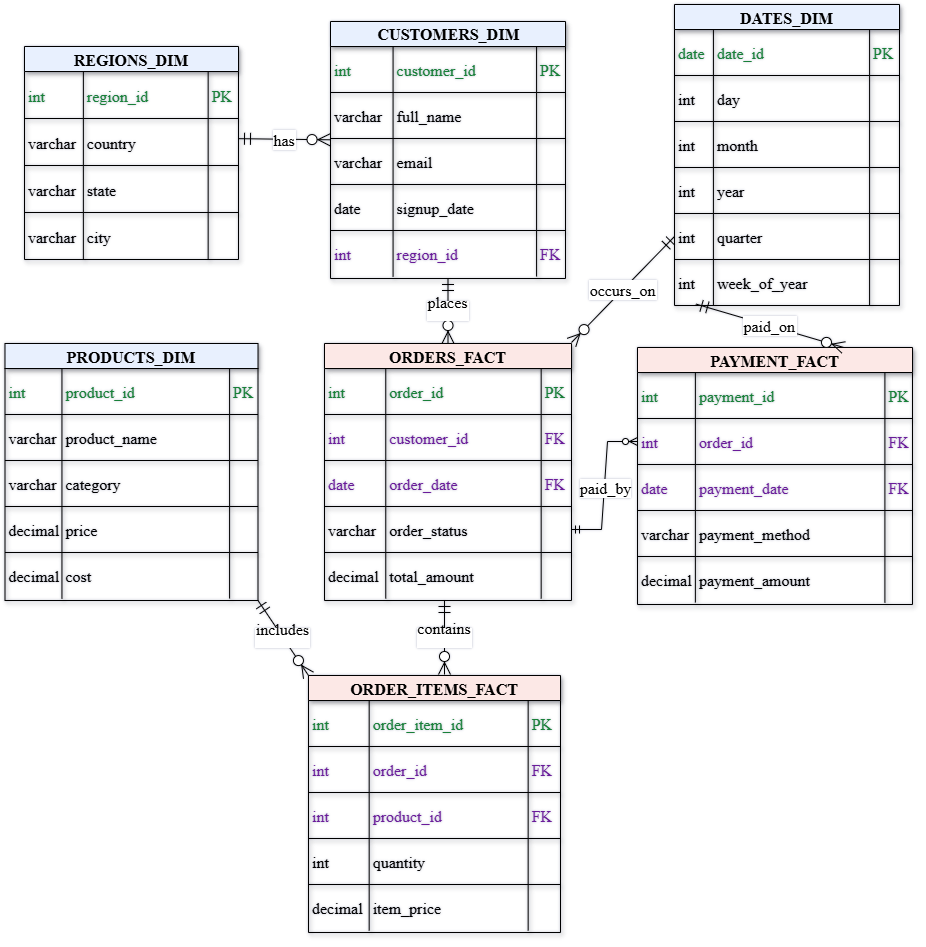

# 📊 E-Commerce Analytics Dashboard

An end-to-end **data science and analytics project** that converts raw e-commerce data into actionable business insights using **SQL data modeling, Python analytics, visualization, and machine learning**.

The project simulates a real-world analytics workflow where data is collected, modeled, analyzed, visualized, and finally used for **predictive decision-making**.

---

## 🚀 Tech Stack
- **Python** (Pandas, NumPy, Matplotlib)
- **SQL** (Star Schema, Fact & Dimension Tables, KPI Queries)
- **Flask** (Backend integration)
- **Machine Learning** (Regression-based revenue prediction)
- **HTML / CSS** (Dashboard UI)

---

## 📌 Key Features
- Business KPIs: **Total Revenue, Average Order Value, Total Customers**
- **Monthly Revenue Trend Analysis**
- **Revenue Analysis by Product Category**
- **Top Products by Revenue Contribution**
- **Customer Order Frequency Analysis**
- **Top Customers by Revenue**
- **Machine Learning–based Next Month Revenue Prediction**

---

## 📂 Project Structure
ecommerce-analytics-dashboard/
│
├── SQL/
│ ├── 01_schema/ # Database schema and table creation scripts
│ ├── 02_seed_data/ # Dimension and sample data insertion
│ ├── 03_fact_data/ # Fact table population scripts
│ └── 04_analytics_queries/ # KPI and analytical SQL queries
│
├── Python_Analytics/
│ ├── 01_db_connection/ # Database connection configuration
│ ├── 02_analysis/ # Revenue, product, customer & payment analysis
│ ├── 03_utils/ # Data cleaning and helper utilities
│ └── 04_visualisations/ # Chart and visualization scripts
│
├── Web_app/
│ └── backend/ # Flask backend and API routes
│
├── screenshots/ # Dashboard screenshots and previews
│
├── README.md # Project documentation
└── .gitignore # Ignored files and folders

---

## 📸 Dashboard Preview

### 🧩 Database Schema

The schema diagram illustrates the **star schema setup**, showing the relationships between **fact and dimension tables**, which forms the foundation for all analytics queries and KPIs.

---

## 🧠 Machine Learning
A **regression-based machine learning model** is trained on historical sales data to **predict probable revenue for the next month**.  
This forecasting component demonstrates how machine learning can support **business planning and data-driven decision-making**.

---

## 📝 How to Run Locally
1. Set up the database using SQL scripts inside the `SQL/` folder  
2. Update database credentials in Python connection files  
3. Run analytics scripts from `Python_Analytics/`  
4. Start the Flask backend to view the dashboard  

---

## 🎯 Learning Outcomes
- Designed a **data warehouse–style schema** for analytics
- Performed **exploratory data analysis (EDA)** using SQL and Python
- Built **modular analytics pipelines** in Python
- Visualized business insights for non-technical stakeholders
- Applied **machine learning for revenue forecasting**

---

## 📌 Use Case

This project is suitable for:
- **Data Science internships** focusing on business data analysis and insight generation  
- **Machine Learning internships** involving regression-based forecasting and predictive analytics  
- SQL + Python analytics case studies  
- End-to-end data pipeline and analytics system demonstrations  

It highlights the integration of **data science concepts and machine learning techniques** within a real-world e-commerce analytics scenario.
